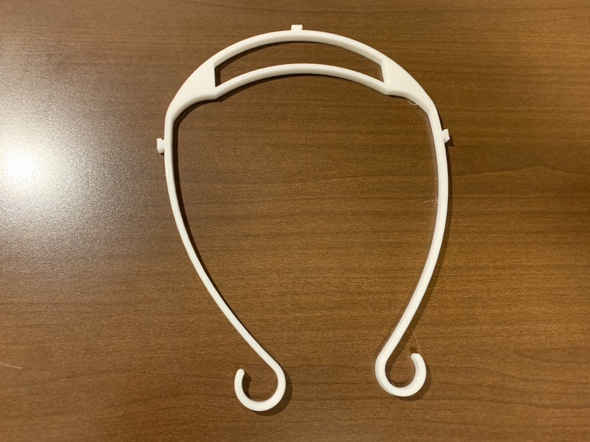

# はじめに -DOYO model
フェイスシールドDOYO modelは3Dプリントできるオープンソースのフェイスシールドです。様々な方が本データを使ったり改変したりして、フェイスシールドが必要な場所に届けばと思い、改良を繰り返しながらデータを公開しております。改変なども自由に行ってください。
みなさまの使っている姿を見ることが励みになります。SNSで#doyomodel とハッシュタグをつけて投稿していただけるか、時間に余裕のある際にでもdoyo@kanagawa-u.ac.jpに写真をお送りいただけると大変嬉しいです。また、販売、配布等する場合はオープンソースのDOYO modelを使用している旨のクレジットを入れ、[クリエイティブコモンズBYSA](https://creativecommons.org/licenses/by-sa/3.0/deed.ja)に準拠した利用をお願いいたします。

道用大介

# 作ったものを他人に渡す場合の注意
つくる側の人は全て感染していることが前提で、製作時はマスクや手袋を着用し、使用予定日の３日前には製作と梱包を終え、引き渡しましょう。できれば出荷前にPLAなら次亜塩素酸ナトリウム（キッチンハイターなど）での消毒が好ましいようです。0.01%(キッチンハイターキャップ１杯に対して水5L）程度に薄めて5分以上浸しましょう。[参照](https://help.prusa3d.com/en/article/prusa-face-shield-disinfection_125457?fbclid=IwAR1E9TaWje1hrFnzYF6KLgC5qMqZX60T88_2Ch9ydYj7H9O7tvyOMQv_r-4#not-recommended-methodshttps://help.prusa3d.com/en/article/prusa-face-shield-disinfection_125457?fbclid=IwAR1E9TaWje1hrFnzYF6KLgC5qMqZX60T88_2Ch9ydYj7H9O7tvyOMQv_r-4#not-recommended-methods)

# 消毒とクリアファイルの取り替え
繰り返し利用する場合は消毒してください(上記参照)。クリアファイルは作り方を参考に適宜取り替えましょう。
クリアファイルはラミネートフィルムでも代用できます。ラミネートフィルムの方がコストは安く抑えられますが、ラミネーターを通してからのものを使用しないと透明度が出ません。(100μmのものでも強度的に問題ないようです。）透明度はラミネートフィルムのほうが高いです。

# 作り方
いくつかバージョンがあります。　造形時間は造形スピード60mm/s,積層ピッチ0.2mmの場合。参考原価は1kg3000円のフィラメントを使った場合のフィラメント費用。比較対象として記載しておくと[PRUSA](https://www.prusaprinters.org/prints/25857-prusa-protective-face-shield-rc2)のFacesheildは造形時間203分、参考原価132円になります。ご自身の活用にあったものをお使いください。

## fastモデル（特徴：短時間造形＆輪ゴムより長いゴムが必要になる）
作り方は[ここ](ver2_small/README.md)を参照してください。クリアファイルの穴あけ方法も書いてあります。

最も造形時間が短く（31分）、単価が安い。参考原価（21円）

## hybridモデル（特徴：fastモデルとeasyモデルを掛け合わせたもの）
作り方は[ここ](ver2_hybrid/README.md)を参照してください。クリアファイルの穴あけ方法も書いてあります。

穴の間隔が穴あけパンチの間隔になっているので、穴あけが簡単。
造形時間はfastモデルより少し長くかかりますが短いです（42分）。参考単価(27円)

## easyモデル（特徴：クリアファイルの穴が開けやすい）
作り方は[ここ](ver1_4hole/README.md)を参照してください。クリアファイルの穴あけ方法も書いてあります。ゴム掛け部分は[3DVerkstan](https://www.youmagine.com/designs/protective-visor-by-3dverkstan)のオープンソースデザインを参考にしています。

フィット感が良い。穴の間隔が穴あけパンチの間隔になっているので、穴あけが簡単。
造形時間は少し長い(60分)参考原価（42円）

## basicモデル（初期）
作り方は[ここ](ver1_3hole/README.md)を参照してください。クリアファイルの穴あけ方法も書いてあります。ゴム掛け部分は[3DVerkstan](https://www.youmagine.com/designs/protective-visor-by-3dverkstan)のオープンソースデザインを参考にしています。

フィット感は最も良い。
造形時間は少し長い(64分)参考原価（45円）

