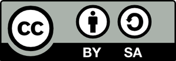
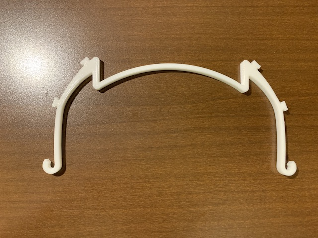
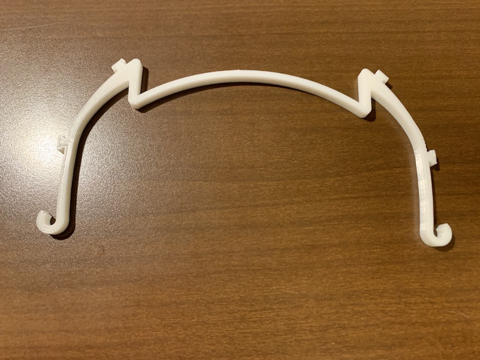
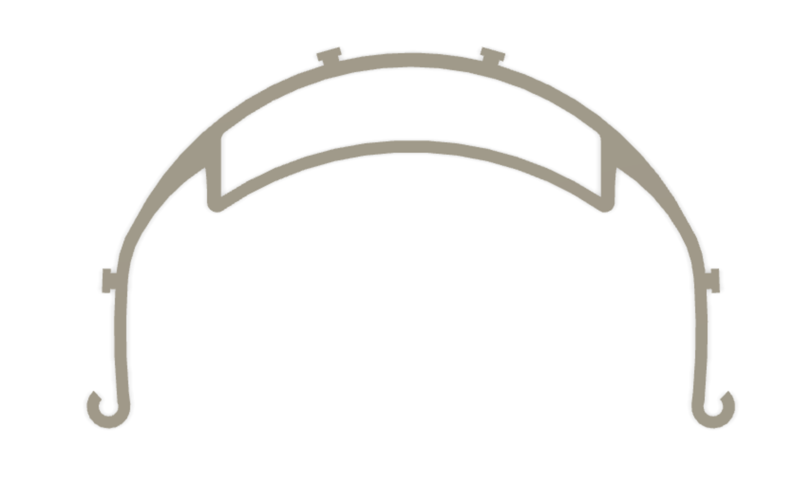
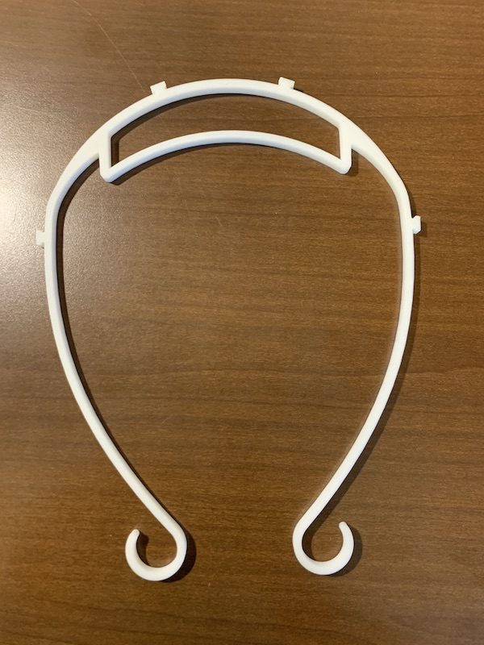

# はじめに -DOYO model
フェイスシールドDOYO modelは3Dプリントとクリアファイルで作るオープンソースのフェイスシールドです。様々な方が本データを使ったり改変したりして、フェイスシールドが必要な場所に届けばと思い、改良を繰り返しながらデータを公開しております。改変なども自由に行ってください。
みなさまの使っている姿を見ることが励みになります。SNSで#doyomodel とハッシュタグをつけて投稿もしくは、時間に余裕のある際にでもdoyo@kanagawa-u.ac.jpに写真をお送りいただけると大変嬉しいです。また、販売、配布等する場合はオープンソースのDOYO modelを使用している旨のクレジットを入れ、[クリエイティブコモンズBYSA](https://creativecommons.org/licenses/by-sa/3.0/deed.ja)に準拠した利用をお願いいたします。少しでも多くの方が安心できる状況になることを切に願っております。

道用大介

# 作ったものを他人に渡す場合の注意
つくる側の人は全て感染していることが前提で、製作時はマスクや手袋を着用し、使用予定日の３日前には製作と梱包を終え、引き渡しましょう。できれば出荷前にPLAなら次亜塩素酸ナトリウム（キッチンハイターなど）での消毒が好ましいようです。[参照](https://help.prusa3d.com/en/article/prusa-face-shield-disinfection_125457?fbclid=IwAR1E9TaWje1hrFnzYF6KLgC5qMqZX60T88_2Ch9ydYj7H9O7tvyOMQv_r-4#not-recommended-methodshttps://help.prusa3d.com/en/article/prusa-face-shield-disinfection_125457?fbclid=IwAR1E9TaWje1hrFnzYF6KLgC5qMqZX60T88_2Ch9ydYj7H9O7tvyOMQv_r-4#not-recommended-methods)

# 消毒とクリアファイルの取り替え
繰り返し利用する場合は消毒してください(上記参照)。クリアファイルは作り方を参考に適宜取り替えましょう。

# 道具と素材のあれこれ
1. クリアファイルはテージーの[CBC24](https://jp.misumi-ec.com/vona2/detail/223006915907/?HissuCode=CBC-24)が透明度が高い
2. クリアファイルはラミネートフィルムでも代用できます。ラミネートフィルムの方がコストは安く抑えられますが、ラミネーターを通してからのものを使用しないと透明度が出ません。(100μmのものでも強度的に問題ないようです。ラミネートフィルムの透明度は高いです。
3. 穴あけパンチは[1つ穴](https://www.amazon.co.jp/%E3%82%AB%E3%83%BC%E3%83%AB%E4%BA%8B%E5%8B%99%E5%99%A8-%E7%A9%B4%E3%81%82%E3%81%91%E3%83%91%E3%83%B3%E3%83%81-18%E6%9E%9A-%E3%83%96%E3%83%AB%E3%83%BC-SD-15-3-B/dp/B002UKPANU/ref=pd_lpo_229_t_0/355-5200154-9043314?_encoding=UTF8&pd_rd_i=B00CEPLT8Q&pd_rd_r=7bf896b1-2a47-4264-9537-bacd488a21b8&pd_rd_w=CTvLL&pd_rd_wg=Ey0jT&pf_rd_p=4b55d259-ebf0-4306-905a-7762d1b93740&pf_rd_r=K69H67YACJRK8N88XNW2&refRID=K69H67YACJRK8N88XNW2&th=1)のものがあると作業しやすい(easyモデルやhybridモデルは2つ穴パンチで作業しやすいようになっている）

# 作り方
特徴の異なるいくつかの形があります。造形時間は造形スピード60mm/s,積層ピッチ0.2mmの場合。参考原価は1kg3000円のフィラメントを使った場合のフィラメント費用。比較対象として記載しておくと[PRUSA](https://www.prusaprinters.org/prints/25857-prusa-protective-face-shield-rc2)のFacesheildは造形時間203分、参考原価132円になります。ご自身の活用にあったものをお使いください。

## 推奨：fastモデル-typeV（慶應義塾大学看護医療学部FabNurseプロジェクトモデル）
慶應義塾大学看護医療学部FabNurseプロジェクト（代表宮川祥子）と共同開発。医療現場の意見を取り入れたモデルです。

特徴：短時間造形、A4クリアファイルを縦横どちらでも使える、輪ゴムより長いゴムが必要になる

データと作り方は[ここ](ver2_fast_typeV/README.md)を参照してください。クリアファイルの穴あけ方法も書いてあります。

最も造形時間が短く（31分）、単価が安い。参考原価（21円）　造形サイズ160.2mm×74.9mmm×5mm

## fastモデル
特徴：短時間造形、A4クリアファイルは横向きでしか使えない、輪ゴムより長いゴムが必要になる

作り方は[ここ](ver2_small/README.md)を参照してください。クリアファイルの穴あけ方法も書いてあります。A4クリアファイルを横向きにしか使えません(tyep-Vとはツメの位置が異なります。違いはそれだけです。）

最も造形時間が短く（31分）、単価が安い。参考原価（21円）

## hybridモデル
特徴：fastモデルとeasyモデルを掛け合わせたもの、A4クリアファイル横向きのみ

データと作り方は[ここ](ver2_hybrid/README.md)を参照してください。クリアファイルの穴あけ方法も書いてあります。

穴の間隔が穴あけパンチの間隔になっているので、穴あけが簡単。
造形時間はfastモデルより少し長くかかりますが短いです（42分）。参考単価(27円)

## easyモデル
特徴：フィット感がある、バンドは通常の輪ゴムを使える、クリアファイルの穴が開けやすい、A4クリアファイル横向きのみ

データと作り方は[ここ](ver1_4hole/README.md)を参照してください。クリアファイルの穴あけ方法も書いてあります。ゴム掛け部分は[3DVerkstan](https://www.youmagine.com/designs/protective-visor-by-3dverkstan)のオープンソースデザイン(CC-BY-SA)を参考にしています。ご使用する場合はクリエイティブコモンズに準拠してください。

フィット感が良い。穴の間隔が穴あけパンチの間隔になっているので、穴あけが簡単。
造形時間は少し長い(60分)参考原価（42円）

