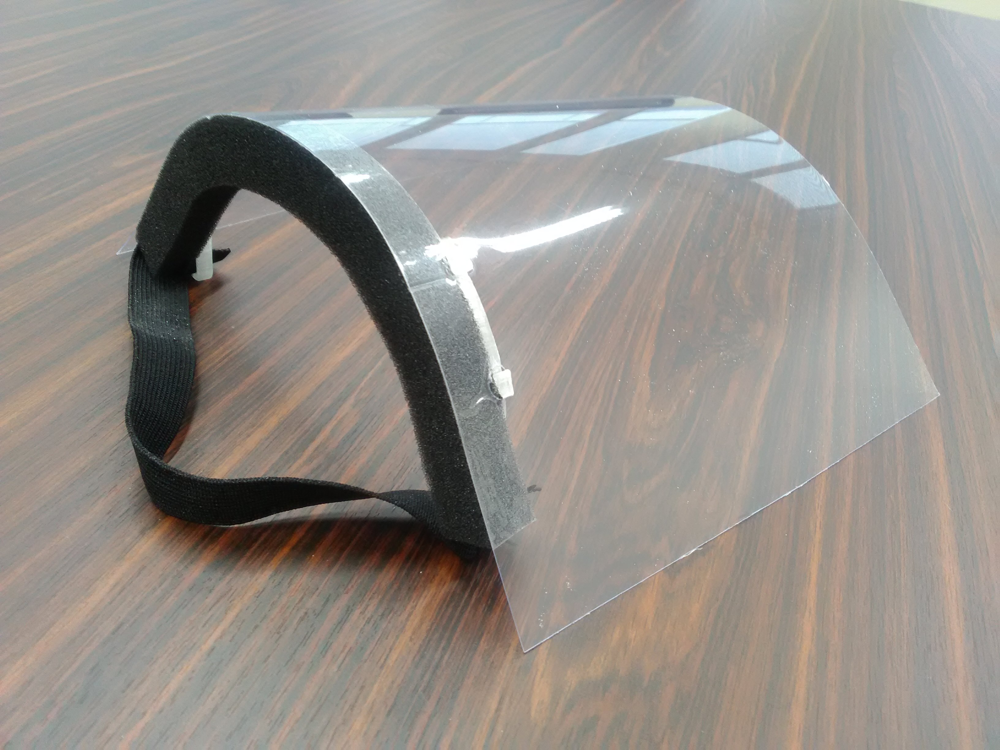

[topへ](https://github.com/doyodoyo/facesheild)

# みんなのアイディア

##マウスシールドにもなる
fast-Vはマウスシールドにもなります。

## 穴の位置にカーブを持たせて、カーブ
国立障害者リハビリテーションセンターさんのアイディア

## Facebookより

[ラミネートフィルムを使う](https://www.facebook.com/photo.php?fbid=3117326378288596&set=a.847356835285573&type=3&theater)

[ラミネートフィルムの温度](https://www.facebook.com/groups/659073201303814/permalink/664039904140477/)

[シールドがポップに！？](https://www.facebook.com/doyo.daisuke/posts/2697922853667372?notif_id=1587383455306069&notif_t=feedback_reaction_generic)

[金型を起こして量産](https://www.facebook.com/AnjoHeartsPROJECT/photos/a.269983163024419/3060270233995684/?type=3&theater)

## Twitterより

[縮小して3Dプリント](https://twitter.com/hnakashima68/status/1251785209571233792?s=20)

## ニュース

[愛知県の中小企業協同組合（アンジョウハーツさん）が連携し生産へ（週４万個生産）](https://www.chunichi.co.jp/article/aichi/20200415/CK2020041502000007.html) 

[山梨県産業技術センターがデータを改変して、生産へ](https://www3.nhk.or.jp/lnews/kofu/20200420/1040009501.html?fbclid=IwAR1uzajhHh1KLtxE0UNZg2SWCiu3LcCxEEYk1E1NLcghTEiGIR1YbIpcXaE)

[ミマキエンジニアリングさんが3Dプリンター100台で生産](https://japan.mimaki.com/news/information/entry-368445.html)

[寄贈のニュース(北海道)](https://www3.nhk.or.jp/sapporo-news/20200424/7000020512.html?fbclid=IwAR3mJzjcBfSal_eJUKolQvsCd76sDXpj-EpysKOpHDjmad_kwJEXYyx-JTA)

[寄贈のニュース（山形県）](https://www3.nhk.or.jp/lnews/yamagata/20200424/6020006694.html)

[寄贈のニュース（静岡県）](https://www.at-s.com/news/article/topics/shizuoka/758964.html)

[学校での活用のニュース（宮城県）](https://www.kahoku.co.jp/tohokunews/202005/20200510_13010.html)

## ミクロン精密さんのスポンジアレンジ

## 大阪の金海さんの穴あけ治具

## 心の距離を縮める工夫

