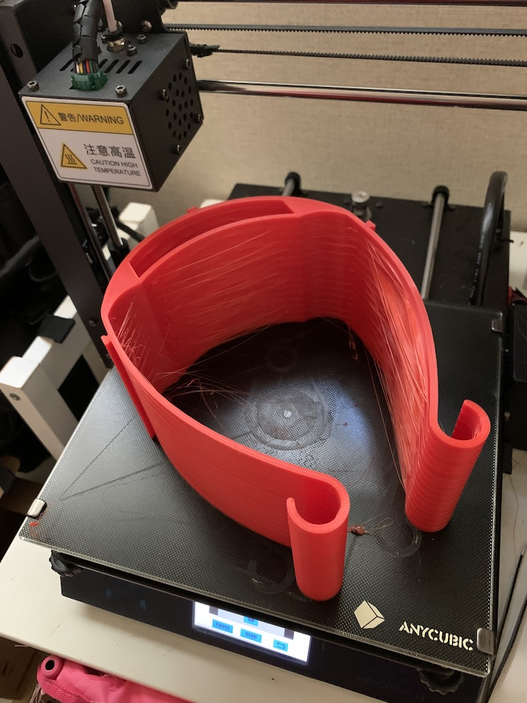
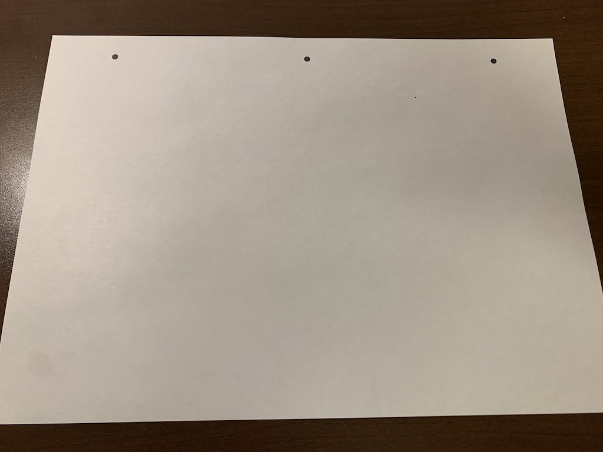
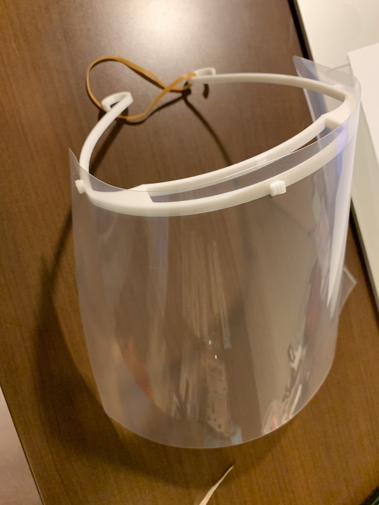

[他のバージョンを見る](https://github.com/doyodoyo/facesheild)

# Face Sheild(フェイスシールド) basicモデル

## tools
1. 3Dprinter(3Dプリンター)
2. box cutter(カッター)
3. pen(ボールペンかマジック)
4. Hole punch(穴あけパンチ）

## materials
1. Filament(PLA,PETG)
2. A4 sized file folder (A4クリアファイル)
3. A4 sized paper(A4の紙)
4. rubber band（輪ゴム）

## 3DPrint
3print this stl file. （このstlファイルをダウンロードして3Dプリントしてください）
[viser.stl](viser.stl)

まとめ作り用ファイル(サポートをdata/付けて出力してください)
[viserX5.stl(5枚)](viserX5.stl)
[viserX10.stl(10枚)](viserX10.stl)
[viserX15.stl(15枚)](viserX15.stl)

まとめ作り

## print
print this pdf file. (このpdfファイルを印刷してください）
[hole.pdf](hole.pdf)

## cut
cut the file folder(クリアファイルをカッターで半分に切ります）

## mark
mark the hole point with printed paper(印刷した紙の上にクリアファイルをおいて、穴を開ける場所に印をつけます）

## punch
make holes with a hole punch(穴あけパンチで穴を開けます）

## assemble
assemble viser and file folder （組み立てます。）

## attention
If you use repeatedly, please disinfect or wash well with soap（繰り返し利用する場合は消毒してください。）

