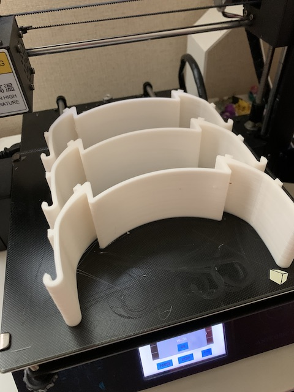
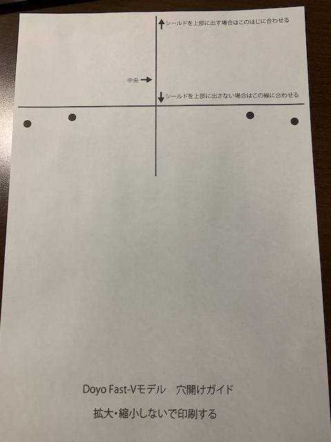
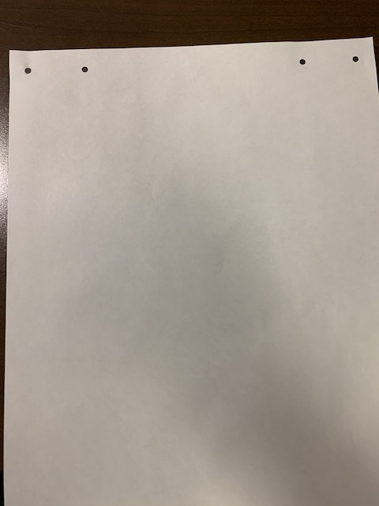
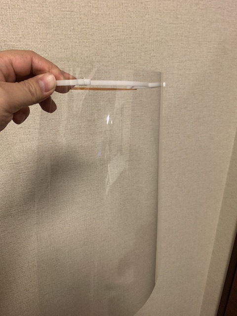

[他のバージョンを見る](https://github.com/doyodoyo/facesheild)

# Face Sheild(フェイスシールド) fast-typeVモデル

慶應義塾大学看護医療学部FabNurseプロジェクトモデル。慶應義塾大学看護医療学部FabNurseプロジェクト（代表宮川祥子）と共同開発。医療現場の意見を取り入れたモデルです。

A4クリアファイルを縦横どちらの向きにでも使えます。

## クレジット表示例
お問い合わせが多いので、クレジットの表示例をお示しします。

例）このフェイスシールドはオープンソースのDOYO modelを使用(or改変)しており、クリエイティブコモンズBYSAに準拠し使用しております。

## tools
1. 3Dprinter(3Dプリンター)
2. box cutter(カッター)
3. pen(ボールペンかマジック)
4. Hole punch(穴あけパンチ）

## materials
1. Filament(PLA,PETG)
2. A4 sized file folder (A4クリアファイル)
3. A4 sized paper(A4の紙)
4. rubber band（平ゴム等のバンド）

## 3DPrint
3print this stl file. （stlファイルをダウンロードして3Dプリントしてください）

[fast-typeV.stl](fast-typeV.stl)

まとめづくりは0.2mm間隔であけてあります。

[10個まとめ作り用データ](fast-typeVX10.stl)

[20個まとめ作り用データ](fast-typeVX20.stl)

[25個まとめ作り用データ](fast-typeVX25.stl)

[30個まとめ作り用データ](fast-typeVX30.stl)

[10個まとめ作り用データ(丸みをつけて一つ一つ剥がしやすい)](fillet-type/fast-typeV-fX10.stl)

[20個まとめ作り用データ(丸みをつけて一つ一つ剥がしやすい)](fillet-type/fast-typeV-fX20.stl)

写真は10個づくりデータを３つ並べたもの

## print
print this pdf file. (pdfファイルを印刷してください）

FabNurseプロジェクトモデル（医療現場の意見を取り入れた配置）
穴の位置に工夫がされており、シールド部分に適切な角度がつくようになっています。
[fabnurse_pdfファイル](hole-fast-V-curve.pdf)

簡易版(従来型)
[簡易的な穴あけ_pdfファイル](hole-fast-typeV.pdf)

## cut
cut the file folder(クリアファイルをカッターで半分に切ります）

## mark
mark the hole point with printed paper(印刷した紙の上にクリアファイルをおいて、穴を開ける場所に印をつけます）

## punch
make holes with a hole punch(穴あけパンチで穴を開けます）

## assemble
assemble parts and file folder （組み立てます。）

## attention
繰り返し利用する場合は消毒してください。
