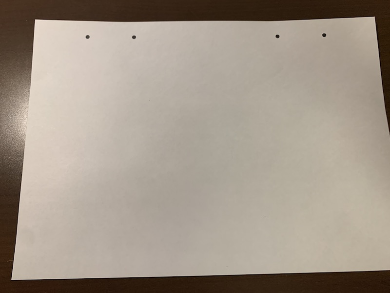

[他のバージョンを見る](https://github.com/doyodoyo/facesheild)

# Face Sheild(フェイスシールド) fastモデル

## クレジット表示例
お問い合わせが多いので、クレジットの表示例をお示しします。

このフェイスシールドはオープンソースのDOYO modelを使用(or改変)しており、クリエイティブコモンズBYSAに準拠し使用しております。

## tools
1. 3Dprinter(3Dプリンター)
2. box cutter(カッター)
3. pen(ボールペンかマジック)
4. Hole punch(穴あけパンチ）

## materials
1. Filament(PLA,PETG)
2. A4 sized file folder (A4クリアファイル)
3. A4 sized paper(A4の紙)
4. rubber band（平ゴム等のバンド）

## 3DPrint
3print this stl file. （stlファイルをダウンロードして3Dプリントしてください）

fast:(A4クリアファイルを横にしか使えません）
[fast.stl](fast.stl)

## print
print this pdf file. (pdfファイルを印刷してください）

fast:A4クリアファイルを横にしか使えない
[台紙fast](hole-fast.pdf)

## cut
cut the file folder(クリアファイルをカッターで半分に切ります）

## mark
mark the hole point with printed paper(印刷した紙の上にクリアファイルをおいて、穴を開ける場所に印をつけます）

## punch
make holes with a hole punch(穴あけパンチで穴を開けます）

穴あけパンチは[1つ穴](https://www.amazon.co.jp/%E3%82%AB%E3%83%BC%E3%83%AB%E4%BA%8B%E5%8B%99%E5%99%A8-%E7%A9%B4%E3%81%82%E3%81%91%E3%83%91%E3%83%B3%E3%83%81-18%E6%9E%9A-%E3%83%96%E3%83%AB%E3%83%BC-SD-15-3-B/dp/B002UKPANU/ref=pd_lpo_229_t_0/355-5200154-9043314?_encoding=UTF8&pd_rd_i=B00CEPLT8Q&pd_rd_r=7bf896b1-2a47-4264-9537-bacd488a21b8&pd_rd_w=CTvLL&pd_rd_wg=Ey0jT&pf_rd_p=4b55d259-ebf0-4306-905a-7762d1b93740&pf_rd_r=K69H67YACJRK8N88XNW2&refRID=K69H67YACJRK8N88XNW2&th=1)のものがあると作業しやすいです。

## assemble
assemble viser and file folder （組み立てます。）

## attention
繰り返し利用する場合は消毒してください。

